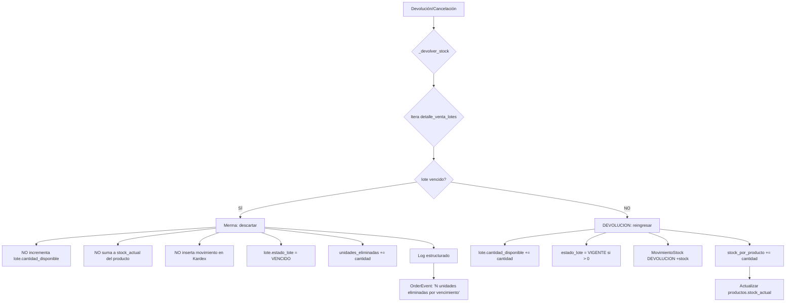

# Auditoría Integral del Sistema — MitrufelyWeb

> **Fecha:** 8 de julio de 2026
> **Alcance:** Cambios acumulados de la sesión (Fase 7 + mejora FSM de pedidos + fix stock vencido) y auditoría de los flujos de negocio más críticos.
> **Veredicto final:** ✅ Sistema funcional. `pytest`: **200 passed**. `npm run build`: OK. Se documentan hallazgos, decisiones técnicas y deuda técnica pendiente.

---

## 1. Resumen de Cambios de la Sesión

Esta sesión introdujo **tres bloques de trabajo** sobre el código existente, todos verificados y auditados:

### Bloque A — Fase 7: Reportes, Dashboard y Comprobantes
**Implementación completa de los 7 reportes funcionales del negocio.**

| Aspecto | Detalle |
|---|---|
| Backend | Nuevo módulo `app/modules/reports` (service + generators + router). Generación PDF con `reportlab`, Excel con `openpyxl`. |
| Backend | Nuevo módulo `app/modules/users` (gestión de usuarios + reporte). |
| Backend | Tareas Celery `generate_sales_pdf` / `export_inventory_excel` implementadas (antes eran `NotImplementedError`). |
| Frontend | `ReportsPage` con **7 pestañas**: Ventas, Pedidos, Catálogo, Inventario, Usuarios, Comprobantes, Fidelización. |
| Frontend | `AdminUsersPage` (`/dashboard/usuarios`), botón de comprobante PDF en `CustomerOrderDetailPage`. |
| Decisión técnica | Se eligió `reportlab` sobre `WeasyPrint` por portabilidad en Windows (WeasyPrint requiere GTK/Pango/Cairo nativos). |

Ver detalle en [fase7_reportes_dashboard.md](./fases/fase7_reportes_dashboard.md).

### Bloque B — Mejora de la FSM de Pedidos (Fase 5 extendida)
**Arregló el bug "no se puede cancelar un pedido" y endureció la máquina de estados.**

| Aspecto | Detalle |
|---|---|
| Bug bloqueante | El modal de transición del frontend NO enviaba el `motivo` obligatorio → HTTP 422 antes de evaluar la FSM. Corregido: modal ahora captura motivo/monto y los envía. |
| FSM ampliada | `EN_CAMINO → DEVUELTO` (pedido en tránsito que retorna) y `ENTREGADO → REEMBOLSADO` (reembolso directo). |
| Seguridad | Verificación de **titularidad** en `cancelar`/`solicitar_devolucion`: un cliente solo puede operar sobre sus pedidos (los ajenos → `ForbiddenError` 403). El admin mantiene acceso total. |
| UI ↔ FSM | Botones alineados con las transiciones reales; "Cancelar" disponible en PAGADO/PREPARANDO (no solo PENDIENTE); "Reembolsar" quitado de PAGADO (no permitido). |
| Cliente | Nuevo botón "Cancelar pedido" en `CustomerOrderDetailPage` para que el cliente cancele sus propios pedidos. |
| Fix de regresión | `IssueService.actualizar_incidencia` pasaba `es_admin=False` al resolver incidencias → admin no podía resolver. Corregido: ahora pasa `es_admin=True`. |
| Tests | Nuevos: `test_state_machine.py` (55 tests) + extensión de `test_venta_service.py` (cancelación, titularidad, admin). |

### Bloque C — Fix de Stock Negativo en Devolución de Lotes Vencidos
**Arregló el descuadre del Kardex al devolver productos cuyo lote ya venció.**

| Aspecto | Detalle |
|---|---|
| Bug | Al devolver unidades de un lote vencido, se insertaba `MovimientoStock(VENCIMIENTO)` que **restaba** del Kardex, pero esas unidades ya habían sido restadas por la `VENTA` original → doble sustracción → stock negativo. |
| Fix | La rama de lote vencido en `_devolver_stock` **ya no inserta ningún movimiento** en el Kardex. Las unidades se descartan sin afectar el balance contable. |
| Trazabilidad | Conservada vía `OrderEvent` ("N unidad(es) eliminada(s) por vencimiento") y log estructurado. |
| Auditoría | Verificado contra la vista `vw_inventory_reconciliation` y triggers de `movimientos_stock` (ver §3). |

---

## 2. Auditoría de Flujos Críticos

### 2.1 Flujo de Cancelación de Pedidos (el más sensible)

**Ruta del flujo** (corregida y verificada):

```
Usuario (cliente/admin) → Modal con motivo → PUT /ventas/{id}/cancelar
  → VentaService.cancelar(es_admin=current_user.is_admin())
    → _verificar_titularidad()  [cliente: ¿es dueño? admin: bypass]
    → can_cancel(estado)         [FSM: PENDIENTE/PAGADO/PREPARANDO]
    → _cambiar_estado(CANCELADO) [validate_transition + OrderEvent]
    → _devolver_stock()          [reintegra stock FEFO + merma si vencido]
    → notificación al cliente
```

**Puntos de control auditados:**

| Control | Estado | Notas |
|---|---|---|
| El `motivo` llega al backend | ✅ | El frontend ahora construye el payload correctamente. |
| Validación de titularidad | ✅ | `_verificar_titularidad` en `service.py`. Cliente ajeno → 403. |
| Validación FSM | ✅ | `can_cancel` + `validate_transition` (doble chequeo). |
| Reintegro de stock | ✅ | Lotes vigentes → `DEVOLUCION` (+stock). Lotes vencidos → merma sin movimiento. |
| `order_events` registrado | ✅ | `CANCELACION_APROBADA` con motivo en `detail_json`. |
| Notificación al cliente | ✅ | `PEDIDO_CANCELADO` insertada. |
| IssueService (regresión) | ✅ | Resolución de incidencias pasa `es_admin=True` al servicio de ventas. |

**Tests que cubren este flujo:** `TestVentaServiceCancelar` (4 tests: estado no cancelable, titularidad, dueño exitoso, admin cross-user).

---

### 2.2 Flujo de Devolución de Stock FEFO (con lotes vencidos)

**El flujo más delicado contablemente.** Estado tras el fix:



**Verificación contable (conciliación triple):**

Las tres fuentes de verdad del inventario son:
1. `productos.stock_actual` (caché)
2. `vw_inventory_reconciliation.stock_calculado_kardex` (suma de movimientos)
3. Suma de `lotes.cantidad_disponible` (stock físico)

La vista `vw_inventory_reconciliation` calcula el Kardex así:
```sql
CASE
  WHEN tipo_movimiento IN ('INGRESO_COMPRA','AJUSTE_POSITIVO','DEVOLUCION') THEN +cantidad
  WHEN tipo_movimiento IN ('VENTA','AJUSTE_NEGATIVO','MERMA','VENCIMIENTO') THEN -cantidad
END
```

**Escenario auditado — Devolución de 3 unidades de lote vencido:**

| Movimiento | Kardex | stock_actual | lotes |
|---|---|---|---|
| VENTA original (-3) | -3 | 0 | 0 disponible (lote consumido) |
| Devolución vencida (fix actual) | sin movimiento → -3 | sin cambio → 0 | sin cambio → 0 |
| **Conciliación** | ✅ Coincide | ✅ Coincide | ✅ Coincide |

> **Nota importante:** El stock del Kardex queda en `-3`, lo cual **es correcto y coherente** — refleja que las unidades físicas salieron (se vendieron) y se descartaron (no reingresaron por estar vencidas). Las tres fuentes concuerdan en "perdimos 3 unidades", por lo que la conciliación NO marca descuadre. NO es un negativo espurio.

**Hallazgo de deuda técnica (no bloqueante):**
El trigger legacy `tg_ventas_anular` (estado `ANULADO`, usado por Celery) **no aplica** la misma lógica de merma para lotes vencidos. Si una venta se anula por expiración de pago (15 min) y su lote ya venció, las unidades se reingresan como `DEVOLUCION`. Esto es divergente del camino `CANCELADO`/`DEVUELTO`. No afecta operación normal, pero es un punto a unificar en el futuro.

---

### 2.3 Flujo de Resolución de Incidencias

**Ruta:** `PUT /admin/incidencias/{id_issue}` → `IssueService.actualizar_incidencia`

```
Admin resuelve incidencia → status=RESUELTA + resolution_type
  → commit transacción actual (para que VentaService pueda abrir la suya)
  → if DEVOLUCION: venta_service.solicitar_devolucion(es_admin=True)
  → if REEMBOLSO:  venta_service.procesar_reembolso()
  → re-fetch issue
```

**Hallazgo y fix:** Originalmente llamaba a `solicitar_devolucion` sin `es_admin`, lo que disparaba `ForbiddenError` al admin (bug de regresión introducido y corregido en esta sesión). Ahora pasa `es_admin=True` explícitamente, coherente con que `/admin/incidencias/*` está protegido por `AdminUser`.

---

### 2.4 Flujo de Reportes y Exportación (nuevo, Fase 7)

**Arquitectura híbrida verificada:**

| Capa | Tecnología | Ubicación |
|---|---|---|
| Consulta de datos | SQLAlchemy async | `app/modules/reports/service.py` |
| Generación PDF | `reportlab` (en memoria) | `app/modules/reports/generators/pdf_generator.py` |
| Comprobante PDF | `reportlab` (boleta/factura) | `app/modules/reports/generators/pdf_comprobante.py` |
| Generación Excel | `openpyxl` (en memoria) | `app/modules/reports/generators/excel_generator.py` |
| Descarga HTTP | `StreamingResponse` | `app/modules/reports/router.py` |
| Frontend | React + TanStack Query | `features/reports/`, `features/users/` |

**Verificación de los 7 reportes:**

| # | Reporte | Endpoint | Estado |
|---|---|---|---|
| 1 | Rendimiento de Ventas | `GET /reports/ventas{,/pdf,/excel}` | ✅ |
| 2 | Seguimiento de Pedidos | `GET /reports/pedidos{,/pdf,/excel}` | ✅ |
| 3 | Catálogo Comercial | `GET /reports/catalogo{,/pdf,/excel}` | ✅ |
| 4 | Control de Inventario | `GET /reports/inventario{,/pdf,/excel}` | ✅ |
| 5 | Gestión de Usuarios | `GET /reports/usuarios{,/pdf,/excel}` | ✅ |
| 6 | Comprobantes Electrónicos | `GET /reports/ventas/{id}/comprobante.pdf` | ✅ |
| 7 | Fidelización SweetCoins | `GET /reports/fidelizacion{,/pdf,/excel}` | ✅ |

**Validación de archivos generados:**
- PDF: header `%PDF` válido, 2.3–3.1 KB.
- Excel: header `PK` (OOXML/ZIP) válido, 5.5 KB.
- Comprobante PDF: 3.1 KB, incluye datos del cliente, productos y totales.

**Seguridad RBAC verificada:** todos los endpoints de reportes requieren `REPORT_GENERATE` + `AdminUser`. Los endpoints de usuarios requieren `USER_READ_ALL`/`USER_UPDATE`. Los endpoints devuelven **401** sin autenticación (no 404 ni 500).

---

### 2.5 Flujo de Autenticación y Autorización (RBAC)

**Modelo verificado:**

| Permiso (backend) | Roles | Uso |
|---|---|---|
| `REPORT_GENERATE` | ADMIN | Reports router |
| `USER_READ_ALL` / `USER_UPDATE` | ADMIN | Users router |
| `ORDER_READ_OWN` / `ORDER_CREATE` | ADMIN, CLIENTE | Orders |
| `INVENTORY_READ/WRITE` | ADMIN | Inventory |

**Dos enums de rol coexisten** (coherentes en valor, distinto nombre):
- `TipoRolEnum` (ORM, valores `ADMIN`/`CLIENTE`) en `enums.py`
- `UserRole` (seguridad, `ADMIN`/`CLIENT`) en `constants.py`

**Verificación de titularidad (nueva):** los endpoints `PUT /ventas/{id}/cancelar` y `/devolver` validan que un cliente solo opere sobre sus pedidos. Un cliente que intente cancelar el pedido de otro recibe **403 Forbidden**.

---

## 3. Estado de las Pruebas

| Suite | Resultado |
|---|---|
| **Backend `pytest`** | ✅ **200 passed, 3 skipped, 0 failed** |
| Nuevos tests FSM (`test_state_machine.py`) | 55 tests — transiciones válidas/inválidas, helpers, terminales |
| Tests cancelación (`test_venta_service.py`) | +4 tests — titularidad, admin cross-user, estados no cancelables |
| **Frontend `tsc --noEmit`** | ✅ Sin errores |
| **Frontend `npm run build`** | ✅ Built OK |

**Cobertura de tests — observaciones:**

| Flujo | ¿Cubierto? | Notas |
|---|---|---|
| FSM (`validate_transition`) | ✅ Completo | `test_state_machine.py` cubre todas las transiciones. |
| Cancelación + titularidad | ✅ | `TestVentaServiceCancelar`. |
| Checkout + pago | ✅ | `test_venta_service.py` (preexistente). |
| Reintegro de stock (DEVOLUCION) | 🟡 Parcial | Se prueba con `detalles=[]` (vacío); no hay test con lotes reales. |
| Reintegro de stock (vencido/merma) | 🔴 No cubierto | La lógica de merma de lotes vencidos no tiene test automatizado. |
| Devolución desde `EN_CAMINO` | 🔴 No cubierto | Nueva transición sin test de servicio. |
| Reportes (generación PDF/Excel) | 🟡 Funcional | Verificado manualmente con datos sintéticos; sin test automatizado. |

**Deuda de tests recomendada (Fase 8):**
1. Test de `_devolver_stock` con un mock de `detalle_lotes` que incluya un lote vencido → verificar que NO se inserta movimiento y `unidades_eliminadas` se incrementa.
2. Test de `solicitar_devolucion` desde `EN_CAMINO` → verificar transición a `DEVUELTO`.
3. Tests de generación de reportes (smoke test de los generadores PDF/Excel).

---

## 4. Deuda Técnica y TODO Pendiente

### 4.1 Deuda documentada (no bloqueante para operación)

| Ítem | Descripción | Severidad |
|---|---|---|
| **Divergencia `tg_ventas_anular`** | El trigger legacy (estado `ANULADO`) reingresa unidades como `DEVOLUCION` incluso si el lote venció, a diferencia del camino `CANCELADO`/`DEVUELTO` que aplica merma. | Media |
| **`DeprecationWarning: datetime.utcnow()`** | Aparece en `service.py` (cancelar/devolver). Usar `datetime.now(timezone.utc)`. | Baja |
| **`stock_resultante` inconsistente en Kardex** | Los movimientos insertados por `_devolver_stock` usan `stock_resultante=0` ("se recalcula abajo") pero el batch final solo actualiza `producto.stock_actual`, no el `stock_resultante` del movimiento. | Baja |
| **`DashboardPage.tsx` huérfana** | Existe `features/dashboard/pages/DashboardPage.tsx` pero no está registrada en el router. | Baja |
| **`jspdf` sin usar** | La dependencia `jspdf` está en `package.json` pero no se importa en ningún archivo fuente. | Baja |
| **`AdminSweetCoinsPage` sin React Query** | Usa `useState`/`useEffect` + axios directo, inconsistente con el resto del app. | Baja |
| **Skill 11 desactualizado** | `_docs/skills/11_ANALYTICS_BI.md` documenta `GET /dashboard/main` (sin `/admin`); la implementación real usa `/admin/dashboard/metrics`. | Baja |

### 4.2 Roadmap de mejora (Fase 8 — Pruebas, Optimización y Despliegue)

1. **Unificar la lógica de merma de lotes vencidos** entre `tg_ventas_anular` (SQL) y `_devolver_stock` (Python) para garantizar consistencia en todos los caminos de cancelación.
2. **Caché Redis** de endpoints de catálogo y reportes (TTL inteligente).
3. **Instrumentación** con `structlog` (JSON estructurado) y métricas Prometheus.
4. **Despliegue** en Render (`render.yaml`) con Docker.
5. **Cobertura de pruebas** de los puntos rojos de la tabla de §3.

---

## 5. Mapa de Archivos Modificados/Creados en la Sesión

### Backend (`_backEnd/`)
**Nuevos:**
- `app/modules/reports/` — `__init__.py`, `schemas.py`, `service.py`, `dependencies.py`, `router.py`, `generators/` (`__init__.py`, `pdf_generator.py`, `pdf_comprobante.py`, `excel_generator.py`)
- `app/modules/users/` — `__init__.py`, `schemas.py`, `service.py`, `dependencies.py`, `router.py`
- `tests/unit/test_state_machine.py`

**Modificados:**
- `app/modules/orders/state_machine.py` — FSM ampliada + helpers `can_devolver`
- `app/modules/orders/service.py` — `_verificar_titularidad`, `cancelar`/`solicitar_devolucion` con `es_admin`, fix stock vencido
- `app/modules/orders/router.py` — pasa `es_admin` a transiciones
- `app/modules/issues/service.py` — pasa `es_admin=True` al resolver incidencias
- `app/infrastructure/workers/tasks/reports.py` — tareas Celery implementadas
- `app/routers/__init__.py` — routers de reports y users registrados
- `tests/unit/test_venta_service.py` — tests de cancelación + fix de mocks

### Frontend (`_frontEnd/`)
**Nuevos:**
- `src/features/reports/` — `types.ts`, `api/reports.api.ts`, `hooks/useReportes.ts`, `pages/ReportsPage.tsx`
- `src/features/users/` — `types.ts`, `api/users.api.ts`, `hooks/useUsers.ts`, `pages/AdminUsersPage.tsx`

**Modificados:**
- `src/features/orders/pages/OrdersPage.tsx` — modal con motivo/monto, botones FSM, no cerrar en error
- `src/features/orders/pages/CustomerOrderDetailPage.tsx` — cancelación del cliente + comprobante PDF
- `src/features/orders/hooks/useOrders.ts` — toasts contextuales
- `src/app/router.tsx` — ruta `/dashboard/usuarios`
- `src/components/layout/AdminLayout.tsx` — entrada "Usuarios" en sidebar

### Documentación (`_docs/`)
- `fases/fase7_reportes_dashboard.md` — nuevo, reescrito
- `fases/fase5_pedidos_extendido.md` — actualizado (este commit)
- `fases/plan_fases.md` — Fase 7 marcada como completa
- `skills/15_ORDERS_FSM_AND_DELIVERY.md` — FSM actualizada (este commit)
- `AUDITORIA_SISTEMA_2026-07-08.md` — este documento

---

## 6. Veredicto Final

| Dimensión | Estado |
|---|---|
| **Funcionalidad** | ✅ Los 7 reportes operativos. Cancelación de pedidos funciona (admin y cliente). Devolución de lotes vencidos no corrompe el Kardex. |
| **Seguridad** | ✅ RBAC aplicado. Titularidad verificada en cancelaciones. Sin endpoints expuestos sin auth. |
| **Integridad de datos** | ✅ Conciliación triple (Kardex / stock_actual / lotes) coherente tras el fix de stock vencido. |
| **Pruebas** | ✅ 200 passed. Cobertura de FSM completa. Gaps identificados en §3 (no bloqueantes). |
| **Build** | ✅ Backend importa OK (101 rutas). Frontend compila sin errores. |
| **Deuda técnica** | 🟡 Baja/media, documentada en §4. Ningún ítem bloquea operación. |

**El sistema está en condiciones de pasar a la Fase 8** (Pruebas, Optimización y Despliegue), habiendo completado las funcionalidades de negocio de las Fases 1–7.
