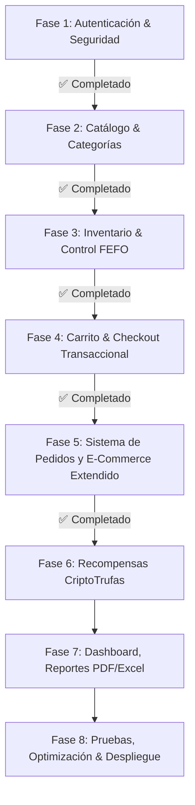

# Plan de Fases de Desarrollo — MitrufelyWeb

Este plan de desarrollo traza el camino detallado y formal desde el estado actual hasta la finalización total del proyecto **MitrufelyWeb**, asegurando un acoplamiento modular limpio y una arquitectura de inyección de dependencias sólida.

---

## 🗺️ Mapa de Fases Estratégicas

---

## 🍰 Detalle de Fases Planificadas

### 🔹 Fase 2: Catálogo de Productos y Categorías
* **Objetivo:** Implementar la visualización del catálogo de trufas artesanales con búsquedas, filtrados dinámicos por categorías y gestión administrativa (CRUD).
* **Backend (`FastAPI`):**
  * CRUD de categorías y productos con slugs autogenerados (`python-slugify`).
  * **Integración con Cloudinary:** Almacenamiento externo de imágenes. La API de FastAPI recibe la foto subida por el administrador, opcionalmente la optimiza con `Pillow` en memoria (redimensionado y compresión ligera) y la sube de forma asíncrona a Cloudinary, guardando únicamente el HTTPS secure URL en `productos.imagen_url`.
  * **Validaciones estrictas de Negocio (Esquemas Pydantic V2):**
    * *Categoría:* Nombre único, obligatorio, entre 2 y 100 caracteres.
    * *Producto:* Nombre único, obligatorio, entre 2 y 150 caracteres. Precio obligatorio, estrictamente positivo (`CHECK precio > 0`). FK `id_categoria` debe ser un ID existente en la tabla `categorias`.
  * Inyección de servicios usando el contenedor `dependency-injector` para desacoplar el acceso a la base de datos.
* **Frontend (`React + TypeScript`):**
  * Vitrina interactiva con barra de búsqueda rápida y filtrado por pestañas utilizando animaciones de transición fluidas (`framer-motion`).
  * Modal detallado de productos con selector de cantidades.
  * Panel de administración para el CRUD de productos con formularios validados dinámicamente con `react-hook-form` + `zod` mapeados exactamente contra los tipos de la BD.

### 🔹 Fase 3: Gestión de Lotes, Kardex e Inventario (Control FEFO)
* **Objetivo:** Asegurar el control estricto de existencias de las trufas artesanales (las cuales son altamente perecederas) mediante lotes numerados y despachos controlados por la regla FEFO.
* **Backend (`FastAPI`):**
  * Entidad de Lote (`fecha_ingreso`, `fecha_vencimiento`, `cantidad_inicial`, `cantidad_disponible`, `estado_lote`).
  * **Validaciones del Lote:** `cantidad_inicial` estrictamente mayor a 0 (`CHECK cantidad_inicial > 0`). Pydantic valida que `fecha_vencimiento` sea posterior a la fecha actual (`fecha_vencimiento > now`), emulando el trigger de base de datos `tg_lotes_validar_insert`.
  * Control de Kardex de movimientos de stock (Ingreso por compra, egreso por venta, mermas por vencimiento).
  * Lógica algorítmica de egreso estricto **FEFO** (First Expired, First Out) al realizar la venta.
  * Manejo de fechas y zonas horarias con `python-dateutil` y `pytz`.
* **Frontend (`React + TypeScript`):**
  * Pantalla de inventario y Kardex reservada exclusivamente para administradores.
  * **Alertas Visuales de Vencimiento Configurable:** El sistema evaluará los días restantes de vida de cada lote. Por defecto, si faltan **3 días** o menos para la fecha de vencimiento (`days_until_expiration <= threshold` usando `date-fns`), el lote se coloreará en ámbar/rojo pastel en el panel de control de inventario para alertar al operario.

### 🔹 Fase 4: Carrito de Compras y Flujo de Checkout Transaccional ✅ IMPLEMENTADO
* **Objetivo:** Permitir a los clientes armar su pedido, realizar el checkout y descontar stock garantizando la integridad de datos bajo concurrencia.
* **Backend (`FastAPI`):**
  * Persistencia del carrito de compras en Redis (`cart:{user_id}`, TTL 7 días, sliding expiration).
  * **Flujo Transaccional con Gobernanza en PostgreSQL:**
    * Validaciones pre-transaccionales sin lock (fast-fail).
    * Transacción única con `async with session.begin()`.
    * Integridad de Concurrencia con `SELECT ... FOR UPDATE` sobre `productos` y `lotes`.
    * Generación automática de `Documento` (BOLETA).

### 🔹 Fase 5: Sistema de Pedidos y E-Commerce (Extendido) ✅ IMPLEMENTADO
* **Objetivo:** Auditar y rediseñar el ciclo de vida del pedido para convertirlo en un sistema de e-commerce moderno, robusto y escalable.
* **Backend (`FastAPI`):**
  * Máquina de estados finita (FSM) inmutable con estados: `PENDIENTE`, `PAGADO`, `PREPARANDO`, `EN_CAMINO`, `ENTREGADO`, `CANCELADO`, `DEVUELTO`, `REEMBOLSADO`, `ANULADO`.
  * Tabla de historial cronológico inmutable (`order_events`).
  * Microservicio asíncrono para simular preparación y entrega (`delivery-service` en puerto 8001).
  * Configuración dinámica en BD (`system_config`) para costos de envío (S/3.00 base, gratis > S/15.00) y tiempos de entrega (ETA calculable en tiempo real).
  * Sistema completo de incidencias (`order_issues`), devoluciones y reembolsos simulados con reposición automática al Kardex.
  * Endpoints completos de tracking para el cliente (`GET /ventas/{id}/tracking`).
  * Panel de métricas e ingresos integrados y dashboard en vivo con conteo por estados, ranking de productos y tendencias en los últimos 30 días.
  * Tabla de `notifications` integradas para informar al cliente de sus cambios de estado y resolver los reportes (polling nativo).

### 🔹 Fase 6: Sistema de Fidelización CriptoTrufas y Cuponería ✅ IMPLEMENTADO
* **Objetivo:** Gamificar la pastelería mediante la moneda interna virtual del proyecto (CriptoTrufas), otorgando puntos por compras e incentivando canjes por cupones de descuento.
* Ver detalle completo en [fase6_criptotrufas_cuponeria.md](./fase6_criptotrufas_cuponeria.md).
* **Backend (`FastAPI`):**
  * Lógica de acumulación de puntos (por ejemplo, 10% del monto total de la venta en CriptoTrufas).
  * Endpoints para canjear saldo de puntos por cupones (con expiración, montos mínimos de compra, estado disponible/usado).
  * Tarea programada en segundo plano con `celery` + `redis` para la expiración automática de puntos no usados tras 365 días.
* **Frontend (`React + TypeScript`):**
  * Visualización premium del balance de CriptoTrufas en la barra de navegación del cliente.
  * Vitrina de canje de cupones con animaciones dinámicas de felicitación (`framer-motion` + `canvas-confetti`).
  * Integración en el Checkout para seleccionar y aplicar cupones de descuento válidos con recálculo dinámico del total de compra.

### 🔹 Fase 7: Panel de Administración, Reportes y Documentos (PDF/Excel)
* **Objetivo:** Proveer herramientas visuales y descargables para que los administradores controlen el negocio y los clientes obtengan sus comprobantes formales.
* **Backend (`FastAPI`):**
  * Generación asíncrona de reportes agregados y KPIs en segundo plano utilizando `celery`.
  * **Generación de Comprobantes PDF con WeasyPrint:** Se utiliza exclusivamente `WeasyPrint` para la conversión de plantillas HTML/CSS premium a PDF.
  * Generación de archivos Excel de Kardex y ventas usando `openpyxl` y `xlsxwriter`.
* **Frontend (`React + TypeScript`):**
  * Dashboard premium para administradores con KPIs interactivos y gráficos SVG responsivos usando la librería `recharts`.
  * Uso de librerías en el cliente como `jspdf` y `exceljs` para descargas inmediatas.

### 🔹 Fase 8: Pruebas, Optimización y Despliegue
* **Objetivo:** Optimizar el rendimiento de la aplicación, asegurar su robustez con cobertura de pruebas automatizadas y realizar el despliegue a producción.
* **Backend (`FastAPI`):**
  * Pruebas unitarias e integración de base de datos asíncronas usando `pytest` + `pytest-asyncio`.
  * Caché de Redis de endpoints de catálogo con TTL inteligente.
  * Instrumentación de logs JSON estructurados (`structlog`) y exposición de métricas Prometheus (`prometheus-fastapi-instrumentator`).
* **Frontend (`React + TypeScript`):**
  * Optimización automática de re-renders mediante `babel-plugin-react-compiler` de React 19.
  * Gestión automatizada pre-commit mediante `husky` y `lint-staged`.
* **Infraestructura:**
  * Configuración completa de orquestación de contenedores en Docker.
  * Despliegue automatizado de la API, worker de Celery y base de datos Neon en la nube con Render (`render.yaml`).
