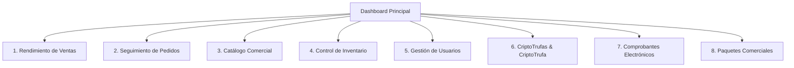

# SKILL 11 — Módulo de Analítica e Inteligencia de Negocio (BI)

> **CUÁNDO USAR:** Antes de diseñar o codificar el panel de administración, gráficos del dashboard, reportes en PDF/Excel, consultas de agregación analítica en el backend o componentes visuales de Recharts en el frontend.

---

## 1. Visión y Objetivos del Módulo

El Módulo de BI de Mitrufely transforma los datos transaccionales del negocio (compras, clientes, inventario, CriptoTrufas, facturación) en valor estratégico e interactivo. Consta de dos pilares clave:
1. **Dashboard Analítico interactivo:** Indicadores clave de rendimiento (KPIs) y gráficos interactivos construidos con **Recharts** con soporte para *drill-down* (profundización a listados filtrados).
2. **Centro de Reportes asíncrono:** Herramienta para auditar, consultar y exportar a **PDF (usando WeasyPrint)** y **Excel (usando openpyxl/xlsxwriter)**.

---

## 2. Paleta de Colores Corporativa (Opción A)

Para mantener una consistencia visual de alta gama que combine con la identidad premium de Mitrufely, los gráficos de Recharts implementarán estrictamente la **Opción A** (colores de marca basados en borgoña y naranja) complementada con tonos armónicos elegantes:

| Uso / Significado | Código HEX | Variable Tailwind/CSS | Representación Visual |
| :--- | :--- | :--- | :--- |
| **Color Primario (Borgoña)** | `#5c0f1b` | `--color-brand-burgundy` | Ventas, Ingresos, Montos totales |
| **Color Secundario (Naranja)** | `#ff7a45` | `--color-brand-orange` | Canjes, Cupones, Proyecciones |
| **Éxito / Normal / Entregado** | `#2e7d32` | `--color-success-forest` | Entregado, Pagado, Stock Normal |
| **Alerta / Crítico / Bajo Stock** | `#d84315` | `--color-warning-rust` | Pendiente, Lotes por Vencer, Bajo Stock |
| **Peligro / Agotado / Anulado** | `#c62828` | `--color-danger-crimson` | Anulado, Agotado, Lote Vencido |
| **Secundarios Armónicos** | `#8d6e63` <br> `#ffb74d` | `--color-cocoa` <br> `--color-gold` | Chocolate/Trufas, CriptoTrufas emitidos |
| **Fondo / Neutral / Inactivo** | `#90a4ae` | `--color-neutral-slate` | Inactivos, Respuestas neutrales |

### Ejemplo de Configuración en React:
```typescript
export const GRAPH_COLORS = {
  burgundy: "#5c0f1b",
  orange: "#ff7a45",
  success: "#2e7d32",
  warning: "#d84315",
  danger: "#c62828",
  cocoa: "#8d6e63",
  gold: "#ffb74d",
  slate: "#90a4ae",
};
```

---

## 3. Arquitectura del Backend: Agregaciones Optimizadas

Para evitar cuellos de botella al calcular métricas en tiempo real en una base de datos operativa, el backend implementará las siguientes directrices:

### A. Índices de Base de Datos Recomendados
Para acelerar las agregaciones, el script físico debe contar con índices en columnas clave de fecha y estados:
```sql
CREATE INDEX IF NOT EXISTS idx_ventas_fecha ON ventas(fecha_venta);
CREATE INDEX IF NOT EXISTS idx_lotes_vencimiento ON lotes(fecha_vencimiento);
CREATE INDEX IF NOT EXISTS idx_ventas_estado ON ventas(estado_venta);
```

### B. Patrón de Repositorio Analítico (`app/modules/dashboard/repository.py`)
En lugar de cargar modelos completos ORM en memoria, utilizaremos **funciones de agregación y proyecciones directas de SQLAlchemy** (`func.sum`, `func.count`, `func.coalesce`) con agrupaciones (`group_by`) para delegar el procesamiento pesado al motor de PostgreSQL.

*Ejemplo didáctico de consulta optimizada para ventas por periodo:*
```python
from datetime import datetime
from sqlalchemy import select, func, coalesce
from sqlalchemy.ext.asyncio import AsyncSession
from app.infrastructure.database.models import Venta, DetalleVenta

async def get_ventas_evolucion_diaria(
    db: AsyncSession, 
    fecha_inicio: datetime, 
    fecha_fin: datetime
) -> list[dict]:
    query = (
        select(
            func.date_trunc('day', Venta.fecha_venta).label('fecha'),
            func.count(Venta.id_venta).label('total_ventas'),
            coalesce(func.sum(Venta.total), 0.0).label('total_ingresos')
        )
        .where(Venta.fecha_venta.between(fecha_inicio, fecha_fin))
        .where(Venta.estado == 'PAGADO') # Filtrar solo transacciones exitosas
        .group_by(func.date_trunc('day', Venta.fecha_venta))
        .order_by(func.date_trunc('day', Venta.fecha_venta))
    )
    result = await db.execute(query)
    return [
        {
            "fecha": row.fecha.strftime("%Y-%m-%d"),
            "total_ventas": row.total_ventas,
            "total_ingresos": float(row.total_ingresos)
        }
        for row in result.all()
    ]
```

---

## 4. Contratos de API (JSON de Dashboard)

Todos los endpoints analíticos se agrupan en `/api/v1/dashboard/*` y deben retornar datos limpios y estructurados bajo el envoltorio unificado del proyecto (`{ success, data, message }`).

### A. Endpoint Dashboard Principal (`GET /api/v1/dashboard/main`)
**Respuesta:**
```json
{
  "success": true,
  "data": {
    "kpis": {
      "ventas_dia": 1250.50,
      "ventas_mes": 34200.00,
      "ventas_pendientes": 8,
      "ventas_entregados": 142,
      "clientes_registrados": 520,
      "clientes_activos": 310,
      "CriptoTrufas_emitidos": 4500,
      "CriptoTrufas_canjeados": 3100,
      "productos_stock_critico": 4,
      "productos_agotados": 2,
      "cupones_activos": 12,
      "comprobantes_emitidos_hoy": 15
    },
    "evolucion_ventas": [
      { "periodo": "2026-05-24", "ingresos": 850.00 },
      { "periodo": "2026-05-25", "ingresos": 1100.00 }
    ],
    "distribucion_ventas": [
      { "estado": "Pendiente", "cantidad": 8 },
      { "estado": "Pagado", "cantidad": 24 },
      { "estado": "Entregado", "cantidad": 142 },
      { "estado": "Anulado", "cantidad": 3 }
    ],
    "top_productos": [
      { "producto": "Trufa de Cacao Borgoña", "ventas": 320 },
      { "producto": "Trufa de Naranja Silvestre", "ventas": 210 }
    ],
    "estado_inventario": [
      { "categoria": "Normal", "productos": 18 },
      { "categoria": "Bajo stock", "productos": 4 },
      { "categoria": "Agotado", "productos": 2 }
    ],
    "CriptoTrufas_balance": {
      "emitidos": 4500,
      "canjeados": 3100
    }
  },
  "message": "Métricas generales obtenidas con éxito"
}
```

---

## 5. Especificación de Dashboards Especializados

El sistema contará con **7 áreas de visualización especializada** accesibles desde la vista ejecutiva.



### 📊 1. Dashboard de Rendimiento de Ventas
* **KPIs:** Ventas totales ($), Ticket promedio ($), Cantidad de ventas (#), Ingreso promedio diario ($).
* **Gráficos:**
  * **Evolución de ventas por período:** `LineChart` interactivo (Borgoña `#5c0f1b`).
  * **Comparativa de ventas intermensual:** `BarChart` agrupado por mes actual vs anterior.
  * **Métodos de pago utilizados:** `PieChart` / `DonutChart` (Tarjeta, CriptoTrufas).
  * **Top 10 productos más vendidos:** `BarChart` horizontal (Naranja `#ff7a45`).

### 📦 2. Dashboard de Seguimiento de ventas
* **KPIs:** ventas pendientes, ventas pagados, ventas entregados, ventas anulados.
* **Gráficos:**
  * **Flujo e histórico de estados:** `AreaChart` de estados acumulados en el tiempo.
  * **Distribución de ventas por estado:** `PieChart` interactivo con colores semánticos (`GRAPH_COLORS.success`, `warning`, `danger`).
  * **Tiempo promedio de procesamiento:** `BarChart` indicando horas/minutos promedio desde venta hasta entrega por día de la semana.

### 🏷️ 3. Dashboard de Catálogo Comercial
* **KPIs:** Productos activos, Productos inactivos, Categorías registradas en total.
* **Gráficos:**
  * **Productos por categoría:** `BarChart` vertical con distribución de catálogo.
  * **Distribución de precios:** `ScatterPlot` o `BarChart` de rango de precios para evaluar márgenes y precios promedio por categoría.
  * **Estado del catálogo:** `PieChart` (Activos vs Inactivos).

### 🔍 4. Dashboard de Control de Inventario
* **KPIs:** Stock total disponible, Productos con bajo stock (< stock mínimo), Productos agotados (0 unidades), Lotes vigentes, Lotes vencidos.
* **Gráficos:**
  * **Vencimientos próximos (Alerta 3 días predeterminada):** `BarChart` con fecha de vencimiento detallando qué lotes expiran en los próximos 3, 7 y 15 días.
  * **Movimientos de stock (Kardex agregado):** `LineChart` de doble eje mostrando ingresos (compras) vs salidas (ventas) semanales.
  * **Rotación de productos:** `BarChart` comparando días promedio que un lote permanece en almacén antes de agotarse.

### 👥 5. Dashboard de Gestión de Usuarios
* **KPIs:** Usuarios totales registrados, Clientes registrados, Usuarios activos, Distribución por rol.
* **Gráficos:**
  * **Crecimiento de usuarios:** `AreaChart` mostrando la curva de registro acumulado en el tiempo.
  * **Distribución por roles:** `DonutChart` (ADMIN, CLIENTE).
  * **Actividad reciente del sistema:** `BarChart` de logins diarios.

### 🍬 6. Dashboard de Fidelización CriptoTrufas / CriptoTrufa
* **KPIs:** CriptoTrufas emitidos, CriptoTrufas canjeados, CriptoTrufas expirados, Cupones utilizados, Cupones disponibles.
* **Gráficos:**
  * **Emisión vs Canje de CriptoTrufas:** `BarChart` comparativo mensual.
  * **Estado de cupones creados:** `PieChart` (Disponibles, Usados, Expirados).
  * **Top 10 clientes fidelizados:** Tabla/Lista interactiva integrada y `BarChart` de mayores acumuladores de puntos.
  * **Origen de acumulación de puntos:** `DonutChart` (Compras online, Eventos especiales, Registro inicial).

### 🧾 7. Dashboard de Comprobantes Electrónicos
* **KPIs:** Boletas emitidas, Facturas emitidas, Comprobantes generados hoy.
* **Gráficos:**
  * **Documentos por tipo:** `PieChart` interactivo (Boleta vs Factura).
  * **Emisiones por fecha:** `LineChart` de cantidad de comprobantes emitidos.
  * **Tendencia de facturación mensual:** `BarChart` del monto total facturado desglosado por impuestos (IGV) vs base imponible.

### 🎁 8. Dashboard de Paquetes Comerciales
* **KPIs:** Paquetes vendidos, Ingresos generados por paquetes, Ticket promedio de paquetes, Paquete más vendido, Porcentaje de ventas provenientes de paquetes, Paquetes activos.
* **Gráficos:**
  * **Top 10 paquetes más vendidos:** `BarChart` horizontal.
  * **Ingresos por paquete:** `BarChart` vertical con montos.
  * **Evolución de ventas de paquetes:** `LineChart` en el tiempo.
  * **Participación de paquetes vs productos individuales:** `PieChart`.
  * **Conversión comercial (Ventas individuales vs paquetes):** `AreaChart` o `BarChart` comparativo.
* **Interacción (Drill-Down):** Al seleccionar un paquete, visualizar: Detalle del paquete, Composición (receta), Ventas asociadas, Ingresos generados y Clientes que lo adquirieron.

---

## 6. Frontend: Implementación Premium con Recharts

Para garantizar animaciones fluidas, diseño totalmente adaptivo y consistencia visual:

### A. Estructura de un Gráfico de Evolución de Ventas Adaptivo
```typescript
import React from 'react';
import { 
  ResponsiveContainer, 
  LineChart, 
  Line, 
  XAxis, 
  YAxis, 
  CartesianGrid, 
  Tooltip, 
  Legend 
} from 'recharts';
import { GRAPH_COLORS } from './colors';

interface VentasChartProps {
  data: Array<{ periodo: string; ingresos: number }>;
}

export const VentasLineChart: React.FC<VentasChartProps> = ({ data }) => {
  return (
    <div className="w-full h-80 bg-white dark:bg-slate-900 p-4 rounded-2xl shadow-sm border border-slate-100 dark:border-slate-800">
      <h3 className="text-lg font-bold text-slate-800 dark:text-white mb-4">Evolución de Ingresos</h3>
      <ResponsiveContainer width="100%" height="90%">
        <LineChart data={data} margin={{ top: 10, right: 10, left: -10, bottom: 0 }}>
          <CartesianGrid strokeDasharray="3 3" stroke="#f1f5f9" className="dark:stroke-slate-800" />
          <XAxis 
            dataKey="periodo" 
            tick={{ fill: GRAPH_COLORS.slate, fontSize: 12 }} 
            axisLine={false}
            tickLine={false}
          />
          <YAxis 
            tick={{ fill: GRAPH_COLORS.slate, fontSize: 12 }}
            axisLine={false}
            tickLine={false}
            tickFormatter={(value) => `S/ ${value}`}
          />
          <Tooltip 
            contentStyle={{ 
              backgroundColor: '#1e293b', 
              borderRadius: '12px', 
              border: 'none',
              color: '#ffffff'
            }}
            formatter={(value: any) => [`S/ ${value}`, 'Ingresos']}
          />
          <Line 
            type="monotone" 
            dataKey="ingresos" 
            stroke={GRAPH_COLORS.burgundy} 
            strokeWidth={3}
            activeDot={{ r: 8, fill: GRAPH_COLORS.orange }} 
            dot={{ r: 4, strokeWidth: 2, fill: '#ffffff' }}
          />
        </LineChart>
      </ResponsiveContainer>
    </div>
  );
};
```

### B. Regla de Drill-Down Reactivo
El usuario debe poder hacer clic en una sección del gráfico (ej. barra de "Bajo Stock") y ser redirigido inmediatamente a la vista de inventario con el filtro pre-aplicado.
* **Técnica:** En el componente de Recharts, usa la propiedad `onClick` provista por los elementos de gráficos (`Bar`, `Cell`, `Pie`):
```typescript
const handlePieClick = (state: any) => {
  const filterValue = state.name; // Ej. "Bajo stock"
  navigate(`/inventario?filter=${encodeURIComponent(filterValue)}`);
};

// En Recharts:
<Pie data={data} onClick={handlePieClick}>
  {data.map((entry, index) => (
    <Cell key={`cell-${index}`} fill={getColor(entry.categoria)} />
  ))}
</Pie>
```

---

## 7. Centro de Reportes Asíncrono (Celery + WeasyPrint/Excel)

Los reportes consolidados pueden demorar en procesar grandes volúmenes de datos. Para evitar bloquear el hilo de FastAPI (lo cual generaría HTTP 504 Gateway Timeouts), **toda generación de reporte debe ser delegada a Celery de forma asíncrona**.

### A. Flujo de Generación Asíncrona
```
1. Frontend realiza POST /api/v1/reports/generate (Tipo de reporte, filtros)
2. Backend encola tarea en Celery y retorna: { success: true, task_id: "uuid-xxxx", status: "PENDING" }
3. Frontend inicia un polling corto o se subscribe a notificaciones
4. Celery ejecuta la tarea pesada:
     a. Consulta BD de manera optimizada
     b. Genera el binario (PDF con WeasyPrint o Excel con OpenPyXL)
     c. Sube el archivo a Cloudinary / almacenamiento privado temporal
     d. Guarda el HTTPS secure URL en Redis asociado al task_id
5. Frontend detecta status: "SUCCESS" y descarga el archivo desde el secure URL provisto.
```

### B. Generación de PDF con WeasyPrint
* **Decisión de Arquitectura:** Se utiliza **WeasyPrint** (HTML/CSS premium a PDF) y se descarta **ReportLab** por ser inflexible con el diseño moderno.
* **Diseño del PDF:** La plantilla HTML utilizada para la conversión debe implementar hojas de estilo `@page` limpias, con cabecera y pie de página institucionales en borgoña, tipografía elegante e indicando el número de página dinámico.

*Ejemplo de código en Celery Worker:*
```python
from weasyprint import HTML, CSS
from app.core.config import settings

def generate_pdf_report(html_content: str) -> bytes:
    # Compilación HTML a PDF en memoria con estilos CSS integrados
    pdf_bytes = HTML(string=html_content).write_pdf(
        stylesheets=[
            CSS(string="""
                @page {
                    size: letter;
                    margin: 20mm 15mm 20mm 15mm;
                    @top-center {
                        content: "Mitrufely - Reporte Oficial de Operaciones";
                        font-family: 'Outfit', sans-serif;
                        font-size: 8pt;
                        color: #5c0f1b;
                        border-bottom: 0.5px solid #ff7a45;
                    }
                    @bottom-right {
                        content: "Página " counter(page) " de " counter(pages);
                        font-family: 'Outfit', sans-serif;
                        font-size: 8pt;
                        color: #90a4ae;
                    }
                }
                body { font-family: 'Inter', sans-serif; color: #1e293b; }
                h1 { color: #5c0f1b; border-bottom: 2px solid #ff7a45; padding-bottom: 5px; }
                table { width: 100%; border-collapse: collapse; margin-top: 20px; }
                th { background-color: #5c0f1b; color: white; padding: 8px; font-size: 9pt; }
                td { border-bottom: 1px solid #f1f5f9; padding: 8px; font-size: 8pt; }
                .text-right { text-align: right; }
            """)
        ]
    )
    return pdf_bytes
```

### C. Especificación del Reporte Oficial (Paquetes y Rendimiento)
**Reporte de Rendimiento de Paquetes Comerciales**
- **Información Incluida:** Nombre del paquete, precio, cantidad vendida, ingresos generados, ticket promedio, productos que lo componen, participación porcentual y tendencia temporal.
- **Exportación a PDF (Gerencial):** Resumen ejecutivo con KPIs, ranking de paquetes, gráficos incrustados y conclusiones automáticas.
- **Exportación a Excel (Operativo):** Múltiples hojas detalladas usando `openpyxl`.
  - Hoja 1: Resumen general.
  - Hoja 2: Ventas por paquete.
  - Hoja 3: Evolución temporal.
  - Hoja 4: Composición de paquetes.
  - Hoja 5: Métricas consolidadas.

---

## 8. Filtros Globales Reutilizables

Tanto el Dashboard como el Centro de Reportes deben admitir exactamente el mismo esquema de filtros para garantizar consistencia.

### Schema Pydantic Común (`app/modules/dashboard/schemas.py`)
```python
from pydantic import BaseModel, Field
from datetime import date
from typing import Optional

class ReportFiltersSchema(BaseModel):
    fecha_inicio: Optional[date] = Field(None, description="Fecha de inicio para el rango de análisis")
    fecha_fin: Optional[date] = Field(None, description="Fecha de fin para el rango de análisis")
    id_producto: Optional[int] = Field(None, description="Filtrar por un producto específico")
    id_categoria: Optional[int] = Field(None, description="Filtrar por una categoría de producto")
    id_cliente: Optional[int] = Field(None, description="Filtrar datos de un cliente específico")
    estado_venta: Optional[str] = Field(None, description="Filtrar por estado del venta (PENDIENTE, PAGADO, etc.)")
    metodo_pago: Optional[str] = Field(None, description="Filtrar por método de pago utilizado")
    estado_stock: Optional[str] = Field(None, description="Filtrar inventario (NORMAL, BAJO, AGOTADO)")
```

---

## 9. Lista de Verificación de Cumplimiento (QA)

Antes de dar por implementado el Módulo de Analítica y Reportes, verifica:
- [ ] ¿Los colores del frontend coinciden exactamente con la **Opción A** corporativa?
- [ ] ¿Los gráficos permiten hacer click (*drill-down*) para navegar a las listas de origen?
- [ ] ¿Todas las agregaciones en el backend están optimizadas en SQL, evitando iteraciones en Python?
- [ ] ¿Las consultas de inventario usan la alerta configurable de vencimiento (por defecto **3 días**) de forma consistente?
- [ ] ¿La generación de PDFs utiliza exclusivamente **WeasyPrint** con diseño CSS limpio?
- [ ] ¿Los reportes pesados se encolan asíncronamente en **Celery** en lugar de bloquear FastAPI?
- [ ] ¿El esquema de filtros globales es reutilizado tanto en el dashboard como en el generador de reportes?
