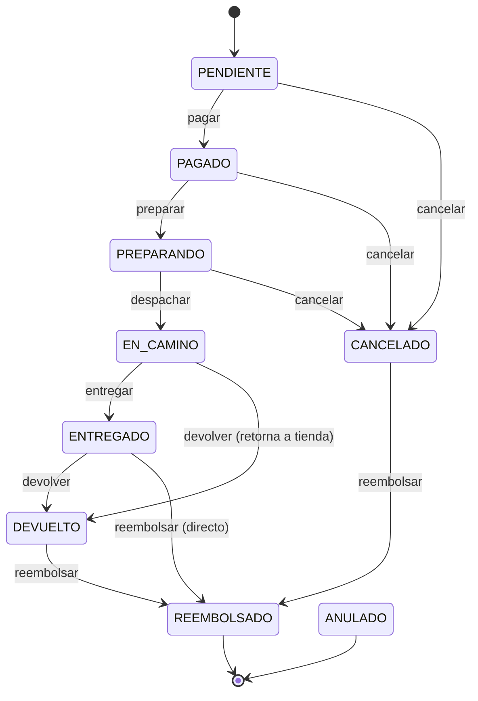

# SKILL 15 — Máquina de Estados de Pedidos (FSM) y Delivery Service (Fase 5 - M14)

> **CUÁNDO USAR:** Antes de implementar lógicas relacionadas con el ciclo de vida extendido de pedidos, tracking, envíos, y notificaciones al cliente.
> **Última actualización:** Julio 2026 (FSM ampliada con escenarios de error)

---

## 1. Visión General del Ciclo de Vida (FSM)

El módulo de pedidos modela un ciclo de e-commerce real mediante una **Máquina de Estados Finita (FSM)** centralizada en `app/modules/orders/state_machine.py`.

### Estados Posibles

- **`PENDIENTE`**: Pedido creado, a la espera de pago.
- **`PAGADO`**: Pago confirmado (manualmente en admin).
- **`PREPARANDO`**: El pedido entra en fase de preparación física/empacado.
- **`EN_CAMINO`**: El pedido ha sido entregado al transportista y está en ruta.
- **`ENTREGADO`**: El cliente recibe su pedido exitosamente.
- **`CANCELADO`**: Anulado antes del pago o durante la preparación.
- **`DEVUELTO`**: El pedido retorna a la tienda (post-entrega o desde tránsito).
- **`REEMBOLSADO`**: El pago es regresado al cliente. **Terminal.**
- **`ANULADO`**: Expiración automática por pago pendiente > 15 min (Celery). **Terminal.**

### Transiciones Válidas (FSM Rules)

Tabla de transiciones (fuente de verdad: `VALID_TRANSITIONS` en `state_machine.py`):

| Origen | Destinos permitidos | Acción |
|---|---|---|
| `PENDIENTE` | `PAGADO`, `CANCELADO` | `pagar`, `cancelar` |
| `PAGADO` | `PREPARANDO`, `CANCELADO` | `preparar`, `cancelar` |
| `PREPARANDO` | `EN_CAMINO`, `CANCELADO` | `despachar`, `cancelar` |
| `EN_CAMINO` | `ENTREGADO`, `DEVUELTO` | `entregar`, `devolver` |
| `ENTREGADO` | `DEVUELTO`, `REEMBOLSADO` | `devolver`, `reembolsar` |
| `CANCELADO` | `REEMBOLSADO` | `reembolsar` |
| `DEVUELTO` | `REEMBOLSADO` | `reembolsar` |
| `REEMBOLSADO` | *(terminal)* | — |
| `ANULADO` | *(terminal)* | — |

### Escenarios de error cubiertos

- **Cancelación del cliente/admin antes del despacho:** `PENDIENTE`/`PAGADO`/`PREPARANDO` → `CANCELADO`.
- **Pedido en tránsito que retorna a tienda** (cliente no ubicado, dirección errada, dañado en ruta): `EN_CAMINO` → `DEVUELTO`. *(Nueva transición, julio 2026.)*
- **Devolución post-entrega:** `ENTREGADO` → `DEVUELTO`.
- **Reembolso directo post-entrega** sin devolución física previa: `ENTREGADO` → `REEMBOLSADO`. *(Nueva transición.)*
- **Reembolso tras cancelación o devolución:** `CANCELADO`/`DEVUELTO` → `REEMBOLSADO`.

### Reglas de gobernanza

- **El administrador y el cliente operan bajo las mismas reglas de transición** (no existe override manual de admin). El control de *quién* puede operar sobre *qué* pedido vive en el servicio, no en la FSM.
- Toda transición inválida lanza `BusinessRuleError` (HTTP 422) con un mensaje que menciona el estado actual y los destinos permitidos.

### Helpers disponibles

| Función | Descripción |
|---|---|
| `validate_transition(actual, nuevo)` | Lanza `BusinessRuleError` si la transición no es válida. |
| `can_cancel(estado)` | `True` para `PENDIENTE`/`PAGADO`/`PREPARANDO`. |
| `can_devolver(estado)` | `True` para `EN_CAMINO`/`ENTREGADO`. |
| `can_request_refund(estado)` | `True` para `ENTREGADO`/`CANCELADO`/`DEVUELTO`. |
| `is_terminal(estado)` | `True` para `REEMBOLSADO`/`ANULADO`. |
| `get_progress(estado)` | Porcentaje visual (10/25/50/75/100). |

---

## 2. Emisión de Eventos (Order Tracking)

Cada transición exitosa en la FSM emite un evento interno en base de datos hacia la tabla `order_events` (historial de tracking).

| Transición | Descripción Generada para el Evento |
|---|---|
| `pagar` | "Pago confirmado. Tu pedido está en la cola de procesamiento." |
| `preparar` | "Tu pedido está siendo preparado y empaquetado." |
| `despachar` | "Tu pedido ha sido entregado al transportista." |
| `entregar` | "El pedido ha sido entregado exitosamente." |
| `reembolsar` | "Se ha procesado un reembolso por tu pedido. Motivo: ..." |
| `devolver` | "El pedido ha sido devuelto a nuestras instalaciones. Motivo: ..." |

Estos eventos se consultan de manera pública/privada vía el endpoint `/ventas/{id}/tracking` para alimentar el componente `OrderTrackingTimeline` del frontend.

---

## 3. Microservicio de Delivery (FastAPI Independiente)

Para separar responsabilidades y simular integraciones de terceros (como un courier), se ha extraído la lógica de costo de envío a un microservicio independiente.

- **Ubicación:** `delivery-service/`
- **Puerto:** `8001` (vía Docker)
- **Responsabilidad:** Calcular el costo de envío dependiendo del subtotal y de la configuración de negocio en tiempo real.
- **Endpoint Principal:** `GET /delivery/quote?subtotal={amount}`

**Flujo de Comunicación:**
1. El frontend envía la petición al Backend Principal (`GET /config/shipping-cost?subtotal=X`).
2. El Backend Principal delega de manera síncrona (vía `httpx`) la cotización al `delivery-service`.
3. El Backend Principal enriquece la respuesta con reglas de negocio (ej. "Aplica envío gratis").
4. El Frontend (`CartView` o `CheckoutPage`) pinta el resultado dinámico en la UI.

---

## 4. Configuración Dinámica de Negocio

El administrador puede cambiar en tiempo real los costos base y los umbrales de envío gratuito sin modificar código ni variables de entorno.

- **Entidad:** `SystemConfig` (Tabla unifilar `system_config` limit 1).
- **Columnas Relevantes:**
  - `shipping_base_cost`: Costo por defecto del envío (ej. S/. 15.00).
  - `free_shipping_threshold`: Monto del carrito para que el envío sea S/. 0.00 (ej. S/. 100.00).
- **Backend Endpoint:** `PUT /admin/config/shipping`
- **Frontend Page:** `/dashboard/config` (`AdminConfigPage.tsx`)

---

## 5. Incidencias y Reseñas (Reviews & Issues)

Se ha añadido la capacidad de que el usuario interactúe sobre su pedido según el estado en el que se encuentre:

1. **Incidencias (Issues)**: 
   - Se habilitan cuando el estado es `EN_CAMINO` o posteriores.
   - Permite reportar "Pedido no llegó", "Paquete dañado", etc.
2. **Reseñas (Reviews)**:
   - Se habilitan exclusivamente cuando el estado es `ENTREGADO`.
   - Permite otorgar una calificación (1-5 estrellas) y un comentario público.

Estas métricas alimentan automáticamente el Dashboard Administrativo.

---

## 6. Sistema de Notificaciones (Polling)

La FSM también genera notificaciones dirigidas al cliente cuando su pedido cambia de estado.

- **Entidad:** `Notificacion`
- **Frontend:** Implementado mediante `react-query` con polling en `useNotifications.ts` (cada 30 seg).
- **UI:** Componente visual de campanita (`NotificationBell.tsx`) en el `Navbar`.

---

## 7. Autorización y Titularidad (RBAC sobre la FSM)

La FSM valida **qué** transiciones son legales; la capa de servicio valida **quién** puede ejecutarlas.

### Modelo de autorización

| Endpoint | Guard | Validación de titularidad |
|---|---|---|
| `PUT /ventas/{id}/cancelar` | `AuthUser` (cliente o admin) | `VentaService._verificar_titularidad` |
| `PUT /ventas/{id}/devolver` | `AuthUser` | `VentaService._verificar_titularidad` |
| `PUT /ventas/{id}/pagar`, `/preparar`, `/despachar`, `/reembolso` | `AdminUser` | Solo admin |
| `POST /ventas/{id}/delivery-completed` | Token del microservicio | Sistema (webhook) |

**Regla:** un CLIENTE solo puede operar sobre sus propios pedidos. Si intenta cancelar/devolver el pedido de otro cliente → `ForbiddenError` (HTTP 403). Los ADMIN tienen acceso total a cualquier pedido.

El flag `es_admin` se deriva de `current_user.is_admin()` en el router y se propaga al servicio. Los flujos internos que operan en contexto administrativo (como `IssueService.actualizar_incidencia`) **deben** pasar `es_admin=True` al invocar a `VentaService`.

### Payloads obligatorios

Las transiciones que modifican el inventario exigen un **motivo** (`CancelRequest`, `DevolucionRequest`) con `motivo` obligatorio (mín. 5 caracteres, máx. 500). El reembolso exige además `monto`. El frontend debe capturarlos en un modal antes de confirmar; de lo contrario el backend responde 422 antes de evaluar la FSM.

---

## 8. Reintegro de Stock (FEFO + Lotes Vencidos)

Cuando un pedido se cancela o devuelve, `VentaService._devolver_stock` revierte el stock consumido. La lógica distingue dos casos:

### Lote vigente → `DEVOLUCION` (+stock)
- Incrementa `lote.cantidad_disponible`.
- Recalcula `estado_lote` a `VIGENTE` si tiene stock.
- Inserta `MovimientoStock(tipo=DEVOLUCION)` → **suma** al Kardex.
- Acumula para actualizar `producto.stock_actual`.

### Lote vencido → MERMA (descarte, sin movimiento contable)
- **No** incrementa `lote.cantidad_disponible` (no se reingresa producto expirado).
- **No** toca `producto.stock_actual`.
- **No** inserta movimiento en el Kardex (las unidades ya fueron restadas por la `VENTA` original; restar de nuevo causaría doble sustracción y stock negativo).
- Asegura `lote.estado_lote = VENCIDO`.
- Cuenta las unidades en `unidades_eliminadas` para el `OrderEvent` final y emite log estructurado `devolucion_merma_lote_vencido`.

> **Por qué sin movimiento:** la vista `vw_inventory_reconciliation` trata `VENCIMIENTO`/`MERMA` como `-cantidad`. Si se insertara, el Kardex aplicaría un segundo descuento sobre unidades que ya salieron por la venta original. Ver auditoría detallada en [AUDITORIA_SISTEMA_2026-07-08.md §2.2](../AUDITORIA_SISTEMA_2026-07-08.md).

### Deuda técnica conocida
El trigger legacy `tg_ventas_anular` (estado `ANULADO`, usado por Celery) **no aplica** esta lógica de merma: reingresa unidades como `DEVOLUCION` incluso si el lote venció. Es divergente del camino `CANCELADO`/`DEVUELTO`. No afecta operación normal; pendiente de unificar.

---

## 7. Alcance y Restricciones (Proyecto Universitario)
- **Docker Compose:** La comunicación Backend <-> Delivery Service se realiza por nombre de contenedor en Docker (`http://delivery:8001`), o `localhost:8001` en dev puro.
- **Notificaciones WebSockets:** Deprecadas en favor de Polling simple para evitar la complejidad de infraestructura bidireccional en el alcance de este proyecto, dado que hay múltiples contenedores.
